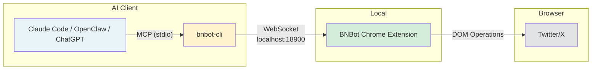

# BNBot Skill

The safest and most efficient way to automate Twitter/X — [BNBot](https://chromewebstore.google.com/detail/bnbot-your-ai-growth-agen/haammgigdkckogcgnbkigfleejpaiiln) operates through a real browser session with 28 AI-powered tools.

## Install

Add to your AI client's MCP config (Claude Code `.mcp.json`, etc.):

```json
{
  "mcpServers": {
    "bnbot": {
      "command": "npx",
      "args": ["bnbot-cli"]
    }
  }
}
```

## Setup

1. Install the [BNBot Chrome Extension](https://chromewebstore.google.com/detail/bnbot-your-ai-growth-agen/haammgigdkckogcgnbkigfleejpaiiln)
2. Open [Twitter/X](https://x.com) in Chrome
3. Open the BNBot sidebar and enable **OpenClaw** in Settings
4. Restart your AI client to activate the MCP connection

## Architecture



## What It Does

This skill lets your AI assistant control Twitter/X through 28 tools:

- **Post** tweets, threads, and long-form articles (with Markdown support)
- **Engage** — like, retweet, quote tweet, reply, follow
- **Scrape** timeline, bookmarks, search results, threads, and account analytics
- **Fetch content** from WeChat, TikTok, and Xiaohongshu for cross-platform repurposing
- **Navigate** Twitter pages (tweets, search, bookmarks, notifications)

All actions go through your real browser session — indistinguishable from manual human behavior, so your account stays safe.

## Requirements

- [BNBot Chrome Extension](https://chromewebstore.google.com/detail/bnbot-your-ai-growth-agen/haammgigdkckogcgnbkigfleejpaiiln) installed and OpenClaw enabled
- Twitter/X open in Chrome
- [bnbot-cli](https://www.npmjs.com/package/bnbot-cli) configured in your AI client's MCP config

## Links

- [BNBot Chrome Extension](https://chromewebstore.google.com/detail/bnbot-your-ai-growth-agen/haammgigdkckogcgnbkigfleejpaiiln)
- [bnbot-cli (npm)](https://www.npmjs.com/package/bnbot-cli)
- [GitHub: bnbot-cli](https://github.com/bnbot-ai/bnbot-cli)
